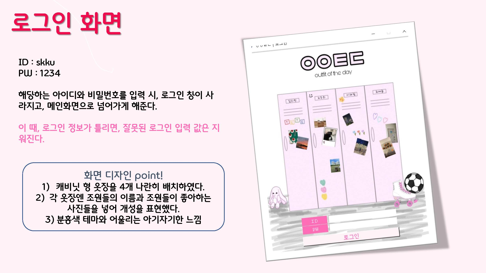

# SKKU-LearningFair-OOTD

- ❓ 2021년 2학기 성균관대학교 문제해결과알고리즘 러닝페어 제출 프로젝트
- ❗️ 문제해결과알고리즘은 1학년 대상으로 파이썬을 배우는 과목으로, 수업에서 배운 내용을 토대로 팀 프로젝트를 진행했습니다.
- 🙆‍♀️ 팀 : 컴퓨터참교육과 21 (김회민, 노주희, 이재림, 최예준)
- 👗 프로젝트 명 : **ㅇㅇㅌㄷ:간편하게 코디하기**

## 세부 기능 및 사용 방법




## 추가 설명

### 프로그램 실행이 안 될 경우 
PIL 라이브러리 설치가 필요합니다!
```
pip install pillow
```
### 로그인 정보
(로그인 기능은 간단한 형식으로 구현했습니다.)
- 아이디: skku 
- 비밀번호: 1234

### 옷장에 옷 추가/삭제하는 법
- 각 옷의 분류에 맞는 폴더에 png 파일을 추가/삭제하여 프로그램에서 이용할 수 있습니다.
    - bottom : 하의 사진을 보관하는 폴더
    - outer : 외투 사진을 보관하는 폴더
    - shoes : 신발 사진을 보관하는 폴더
    - top : 상의 사진을 보관하는 폴더
